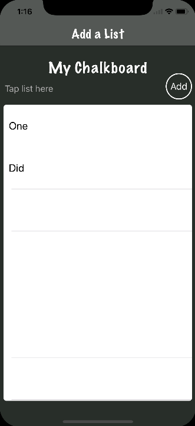
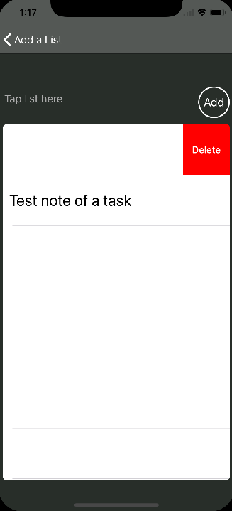
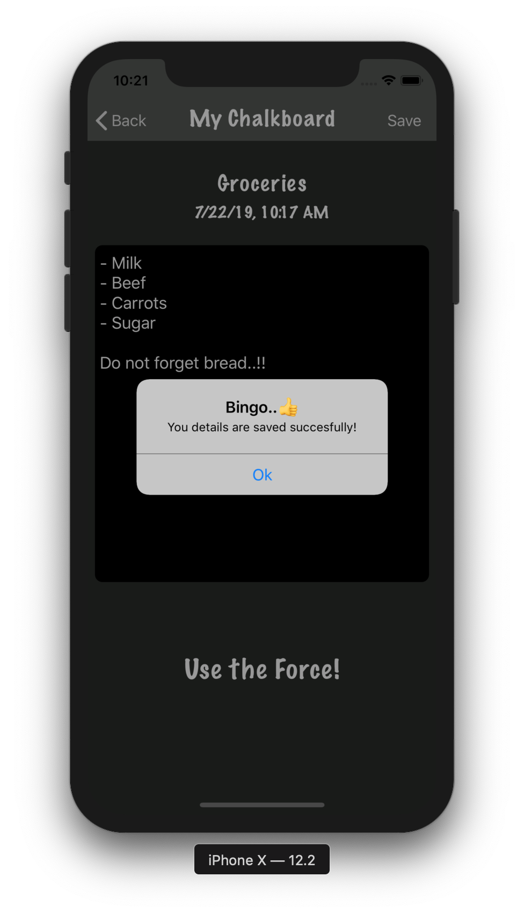

# TheChalkboard-Clone
> This version is coded without storyboards and using user defaults to store data locally based on that any task once is done can be deleted.

## Delete item

## Date Picker

## Saving a detail

